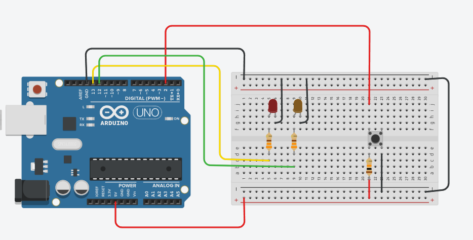

// C++ code
//

#define LED_RED 13
#define LED_YELLOW 12
#define BUTTON 2

int currentButtonState = HIGH;
int previousButtonState = LOW;
boolean buttonStateChanged = false;
int ledRedState = LOW;
int ledYellowState = LOW;
int currentTime = 0;
int previousTime = 0;
int timeDiff = 0;

  
void setup()
{
  pinMode(LED_RED, OUTPUT);
  pinMode(LED_YELLOW, OUTPUT);
  pinMode(BUTTON, INPUT);
}

void loop()
{
  currentTime = millis();
  timeDiff = currentTime - previousTime;
  
  currentButtonState = digitalRead(BUTTON);
  
  if (timeDiff > 1000){
    if (currentButtonState = HIGH){
      ledRedState = ledRedState = LOW? HIGH : LOW;
    } else {
      ledRedState = HIGH;
    }
    
    changeButtonState(currentButtonState);
    previousTime = currentTime;
  }
  
  if (buttonStateChanged) {
    digitalWrite(LED_RED, ledRedState);
  }
}

void changeButtonState(int buttonState){
  previousButtonState != currentButtonState? !buttonStateChanged : buttonStateChanged;
  previousButtonState = currentButtonState;
}

